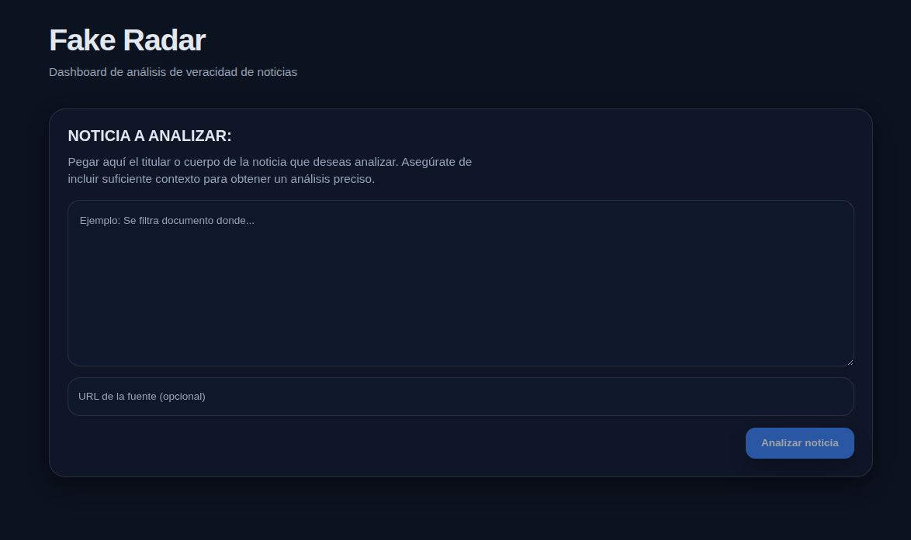
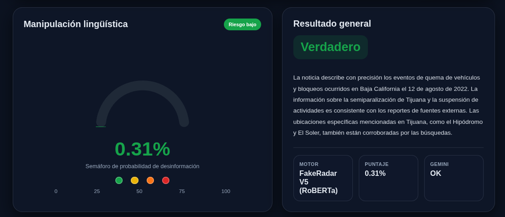
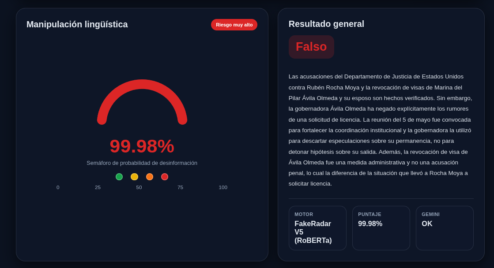

# Interfaz de Usuario - Fake Radar


Esta es la aplicación web cliente de Fake Radar, construida con **React** y empaquetada mediante **Vite** para ofrecer una experiencia de desarrollo rápida y una carga de aplicación optimizada.

## Vista Previa







## Instalación y Configuración Local

Sigue estos pasos para levantar el entorno de desarrollo en tu máquina local:

1. Instala las dependencias del proyecto:

   ```bash
   npm install
   ```

2. Levanta el servidor de desarrollo:

   ```bash
   npm run dev
   ```

3. Abre tu navegador en la URL que se indica en la terminal (usualmente `http://localhost:5173`) para interactuar con la aplicación.
